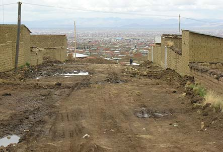
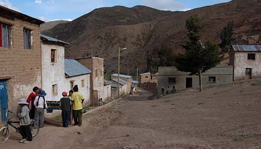

```{r setup, include = F}
library(knitr)
library(stargazer)
library(kableExtra)

source("EDA.R")

adults_r <- adults %>% filter(area == "Rural")
adults_u <- adults %>% filter(area == "Urbana")
```

## Motivations

- Elaborate further on the rural/urban pillar
    - How does the rural/urban divide play out in one's lifetime?
    - When is the inflection point, if any? Does the impact of geography come earlier in life, during one's education, or manifest later, when one enters the workforce?
- Does the generational cycle of poverty really exist? How can we answer this question with cross-sectional data?
- What is the connection between the social class pillar and (in)formal employment? Disentangle the mutual influence between (in)formality and income

## Main components

- Wage premium of higher education between rural and urban areas
- Differences between rural households with and without domestic remittances, which are presumed to come from family members in cities
- Different generations' incomes in multi-generational households
- Incomes of individuals working in formal vs. informal jobs

# Wage premium of higher education between rural and urban areas

## Percentage of adults with higher education

```{r he, echo = F, fig.show = "hold", fig.align = "center", fig.height = 11, out.width = "48%"}
pct_he <- function(df) {
  tot <- nrow(df)
  he <- sum(df$education == "Tertiary")
  he / tot * 100
}
pct_he_r <- pct_he(adults_r)   #0.097
pct_he_u <- pct_he(adults_u)   #0.370

ggplot(data.frame(area = c("rural", "urban"), pct = c(pct_he_r, pct_he_u))) +
  geom_col(aes(area, pct, fill = area), width = 0.5) +
  theme_minimal() +
  labs(y = "% adults with higher ed degree", x = "", title = "There is a large gap in higher ed attainment between\nrural and urban areas") +
  theme(panel.grid.minor = element_blank(), legend.position = "none", text = element_text(size = 20))

# by contrast, pct adults with secondary ed has a much smaller gap
pct_se <- function(df) {
  tot <- nrow(df)
  se <- sum(df$education == "Secondary")
  se / tot * 100
}
pct_se_r <- pct_se(adults_r)   #0.350
pct_se_u <- pct_se(adults_u)   #0.427

ggplot(data.frame(area = c("rural", "urban"), pct = c(pct_se_r, pct_se_u))) +
  geom_col(aes(area, pct, fill = area), width = 0.5) +
  theme_minimal() +
  labs(y = "% adults with secondary ed degree", x = "", title = "By contrast, the gap in secondary education is much smaller") +
  theme(panel.grid.minor = element_blank(), legend.position = "none", text = element_text(size = 20))

```

## LFP rates among adults with higher ed, by area

```{r lfp, echo = F}
pct_lfp <- function(df) {
  tot <- nrow(df)
  lfp <- sum(!is.na(df$primary_job)) + sum(df$looked_for_work == "1. Si", na.rm = T)
  lfp / tot * 100
}
pct_lfp_he_r <- pct_lfp(adults_r %>% filter(education == "Tertiary"))   #0.932
pct_lfp_nohe_r <- pct_lfp(adults_r %>% filter(education != "Tertiary"))
pct_lfp_he_u <- pct_lfp(adults_u %>% filter(education == "Tertiary"))   #0.776
pct_lfp_nohe_u <- pct_lfp(adults_u %>% filter(education != "Tertiary"))

ggplot(data.frame(area = c("rural", "rural", "urban", "urban"),
                  he = c("w/higher ed", "w/o higher ed", "w/higher ed", "w/o higher ed"),
                  pct = c(pct_lfp_he_r, pct_lfp_nohe_r, pct_lfp_he_u, pct_lfp_nohe_u))) +
  geom_col(aes(pct, area, fill = he), width = 0.5, position = "dodge") +
  theme_minimal() +
  labs(x = "% adults in labor force", y = "", subtitle = "", fill = "") +
  theme(panel.grid.minor = element_blank(), legend.position = "bottom")

```

## Average labor earning by higher ed status and area

```{r lab_inc, echo = F}
avg_lab <- function(df) {
  df <- df %>% filter(!is.na(primary_job))
  tot_earn <- sum(df$lab_monthly_inc, na.rm = T)
  tot_earn / nrow(df)
}
avg_lab_he_r <- avg_lab(adults_r %>% filter(education == "Tertiary"))    #4419
avg_lab_nohe_r <- avg_lab(adults_r %>% filter(education != "Tertiary"))  #2315
avg_lab_he_u <- avg_lab(adults_u %>% filter(education == "Tertiary"))    #5045
avg_lab_nohe_u <- avg_lab(adults_u %>% filter(education != "Tertiary"))  #4582

ggplot(data.frame(area = c("rural", "rural", "urban", "urban"),
                  he = c("w/higher ed", "w/o higher ed", "w/higher ed", "w/o higher ed"),
                  pct = c(avg_lab_he_r, avg_lab_nohe_r, avg_lab_he_u, avg_lab_nohe_u))) +
  geom_col(aes(pct, area, fill = he), width = 0.5, position = "dodge") +
  theme_minimal() +
  labs(x = "average monthly labor income (BOB)", y = "", subtitle = "", fill = "") +
  theme(panel.grid.minor = element_blank(), legend.position = "bottom")

```

# Inflection point: when rural residents migrate to cities?

## Rural households with and without domestic remittances

- Households receiving domestic remittances are poorer and not that much smaller
- The per capita income gap is orders of magnitude greater than the gaps in percentage of working adults and per capita weekly work hours

```{r remit_r, echo = F, results = 'asis', message = F}
remit_subset <- function(df) {
  df %>%
  group_by(folio) %>%
  summarize(n = n(), hhsize = dplyr::first(size), remit = sum(dom_trans_monthly_inc), inc = dplyr::first(hh_tot_inc), pc_inc = dplyr::first(pc_inc),
            lfp = sum(!is.na(primary_job) | looked_for_work == "1. Si"), lfp_paid = sum(!is.na(lab_monthly_inc) & lab_monthly_inc > 0),
            working = sum(!is.na(primary_job)), work_hr = sum(tot_work_week_hr, na.rm = T)) %>%
  mutate(has_remit = remit != 0) %>%
  group_by(has_remit) %>%
  summarize(nhh = n(), hhsize = mean(hhsize) %>% round(2), remit = mean(remit) %>% round(), inc = mean(inc) %>% round(), pc_inc = mean(pc_inc) %>% round(),
            n = sum(n), lfp = sum(lfp), lfp_paid = sum(lfp_paid), working = sum(working), work_hr = sum(work_hr)) %>%
  mutate(work_hr = round(work_hr / working, 1), lfp = round(lfp / n * 100, 1), lfp_paid = round(lfp_paid / n * 100, 1)) %>%
  select(-n, -working)
}

remit_r <- remit_subset(adults %>% filter(area == "Rural"))

knitr::kable(remit_r, caption = "Rural households by remittance", align = "c") %>% kable_styling(font_size = 8)

```

## Examine the assumption: which way do remittances flow?

```{r remit_ru, echo = F, results = 'asis'}
remit_u <- remit_subset(adults %>% filter(area == "Urbana"))

knitr::kable(remit_r, caption = "Rural households by remittance") %>% kable_styling(font_size = 8)
knitr::kable(remit_u, caption = "Urban households by remittance") %>% kable_styling(font_size = 8)
```

16% of rural households and 12% of urban households receive domestic remittances

## Examine a deeper assumption: what is rural, what is urban?

- Bolivia's definition of "urban": Localities with 2,000 inhabitants or more (UN, *World Urbanization Prospects*, 2011)
    - The way a "locality's" boundary is drawn can determine whether it counts as urban or rural
- While on paper it seems like 80% of adults live in urban areas (EH 2018), trends like peri-urbanization, expansive urban growth, and diffusion of urban form in villages blur the rural-urban boundaries (O'Hare & Rivas 2007)

<!--   -->

```{r ru_def, echo = F, fig.show = "hold", out.width = "48%", fig.align = "default"}


```

## Examine a deeper assumption: what is rural, what is urban?

- We don't know which way the remittances really flow
- The summary statistics on households w/remittances could change if the threshold of rural/urban is moved
- Moreover, this calls into question the rural/urban pillar itself

## Another look: there are still differences

```{r remit_ru2, echo = F, results = 'asis'}
knitr::kable(remit_r, caption = "Rural households by remittance") %>% kable_styling(font_size = 8)
knitr::kable(remit_u, caption = "Urban households by remittance") %>% kable_styling(font_size = 8)
```

- Remittances are higher among urban households
- Inflection point: **higher education**

## Who are the migrants?

```{r migrant, echo = F, message = F}
adults_he <- adults %>%
  mutate(he = ifelse(education == "Tertiary", "w/higher ed", "w/o higher ed")) %>%
  group_by(area, he) %>%
  summarize(pc_inc = mean(pc_inc), size = mean(size))

ggplot(adults_he) +
  geom_col(aes(pc_inc, area, fill = he), width = 0.5, position = "dodge") +
  theme_minimal() +
  labs(x = "average household per capita monthly income (BOB)", y = "", subtitle = "", fill = "") +
  theme(panel.grid.minor = element_blank(), legend.position = "bottom")

```

People without higher ed come from poorer families, aka families that are more likely to have remittances

## Who are the migrants?

```{r migrant1, echo = F, message = F, warning = F}
adults %>%
  group_by(folio) %>%
  summarize(area = dplyr::first(area), remit = sum(dom_trans_monthly_inc), pc_inc = dplyr::first(pc_inc)) %>%
  mutate(has_remit = ifelse(remit != 0, "w/remits", "w/o remits")) %>%
  ggplot() +
  geom_boxplot(aes(has_remit, pc_inc, fill = has_remit), alpha = 0.5) +
  facet_wrap("area") +
  theme_minimal() +
  ylim(0, 10000) + xlab("") + ylab("per capita monthly income (BOB)") +
  theme(panel.grid.minor = element_blank(), legend.position = "none")
```

## Who are the migrants?

```{r migrant2, echo = F, message = F}
ggplot(adults_he) +
  geom_col(aes(size, area, fill = he), width = 0.5, position = "dodge") +
  theme_minimal() +
  labs(x = "average household size", y = "", subtitle = "", fill = "") +
  theme(panel.grid.minor = element_blank(), legend.position = "bottom")
```

People without higher ed come from slightly larger families, who are more likely to produce surplus labor who flows to cities

## Who are the migrants?

```{r migrant3, echo = F, message = F}
adults %>%
  group_by(folio) %>%
  summarize(area = dplyr::first(area), remit = sum(dom_trans_monthly_inc), women = mean(sex == "2.Mujer") * 100) %>%
  mutate(has_remit = remit != 0) %>%
  group_by(has_remit, area) %>%
  summarize(women = mean(women)) %>%
  ggplot() +
  geom_col(aes(women, area, fill = has_remit), width = 0.5, position = "dodge") +
  theme_minimal() +
  labs(x = "% women or girls", y = "", fill = "receives remittances") +
  theme(panel.grid.minor = element_blank(), legend.position = "bottom")
```

Think: women and girls also tend to be the ones doing unpaid labor

## Connect the dots: extrapolate a "typical" migrant

- From a poor household in need of extra income
- A man
- Without higher education
- There are enough hands at home for subsistence farming or other unpaid family-based productive activities
- Drawn to lucrative jobs in the cities
    - Remember that even someone without a college degree in cities earns a bit more than someone with a college degree in villages
- Make it in the city? How does he stack up against other migrants from (smaller) urban areas, who are more likely to be college educated?  
  
- Migration flow: rural villages --> small cities --> large cities

## The bottom line

- The (first) inflection point comes earlier in life, in higher education attainment
- While the premium for higher ed is high in rural areas, the educational opportunities are low: only <10% go to university
- The disadvantage in education is manifested later on whether one migrates to cities or stays in the countryside and takes on low-paid jobs
- But the educational discrepancy is also a structural issue, where university is reserved for the rich

<!-- # Generational cycle of poverty -->
